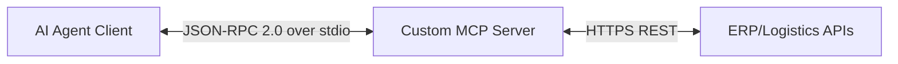

# MCP vs API: Hybrid Production Blueprint

This repository demonstrates a hybrid architecture where:

- **Traditional REST APIs** remain the deterministic system-of-record interface.
- **MCP** adds an agent-native translation/orchestration layer.

It includes:

1. A legacy-style REST API (`legacy_api.py`)
2. An MCP server exposing safe tools over that API (`supply_chain_mcp_server.py`)
3. An agent client orchestration example (`agent_client.py`)

## Why this matters

- REST/GraphQL are optimized for human developers and explicit integration contracts.
- MCP is optimized for LLM tool discovery, semantic intent mapping, and iterative agent loops.
- In production, MCP **does not replace** APIs; it wraps and governs access to them.

## API in detail: what, how it emerged, and why it exists

### What an API is

An API (Application Programming Interface) is a formal contract that lets one software system call another predictably.  
In modern backend systems, this contract usually includes:

- Endpoint paths (for example `/shipments/{id}`)
- Methods (`GET`, `POST`, etc.)
- Input/output schemas
- Error and status code semantics
- Authentication and authorization rules

### How APIs came into existence

APIs became essential as software moved from monolithic, single-interface systems to distributed systems:

1. **Before broad web APIs**: tightly coupled applications and direct database integrations were common.
2. **Web/mobile expansion**: one backend needed to serve many clients (web app, mobile app, partner portals).
3. **Service decomposition**: teams split domains into microservices and needed stable inter-service contracts.
4. **Ecosystem integration**: external partners needed controlled access without direct internal system access.

### Why APIs still matter

APIs are still the core system-of-record interface because they provide:

- **Determinism**: exact request/response behavior under defined contracts.
- **Governance**: versioning, deprecation strategy, access policy enforcement.
- **Security boundaries**: controlled entry points instead of direct data layer access.
- **Auditability**: well-defined mutation surfaces for logs, compliance, and incident response.
- **Multi-client reuse**: one contract used by apps, services, analytics pipelines, and partners.

## MCP in detail: what, how it emerged, and why it exists

### What MCP is

MCP (Model Context Protocol) is a standardized way to expose capabilities to AI agents as discoverable tools/resources.  
Instead of hardcoding every integration path in an agent, MCP lets the agent:

- Discover available tools
- Understand tool intent from metadata
- Call tools with structured arguments
- Continue multi-step reasoning based on returned outputs

### How MCP came into existence

MCP emerged to solve practical LLM integration problems:

1. Agent builders were creating custom, one-off tool bridges per model/provider.
2. Tooling and context interfaces were inconsistent across ecosystems.
3. Teams needed a protocol-level standard for safe, composable model-to-tool interaction.
4. Production agent workflows required iterative loops (observe → decide → act → verify), not one-shot calls.

### Why MCP matters now

MCP is valuable because it enables:

- **Agent-native interoperability**: standard tool interfaces across systems.
- **Intent-driven orchestration**: map high-level goals to concrete operations.
- **Safer execution patterns**: explicit tool scopes, descriptions, and boundaries.
- **Operational flexibility**: evolve agent capabilities without rewriting backend APIs.

## MCP vs API: practical difference

- **API question**: "How can any system reliably call this business capability?"
- **MCP question**: "How can an AI agent safely discover and use capabilities to complete a goal?"
- **Reality in production**: APIs remain the source of truth; MCP coordinates intelligent usage of those APIs.

## Architecture



## Real-life project scenario: Logistics Delay Auto-Mitigation

### Business problem

A shipment is flagged as delayed. Operations teams must quickly:

1. Inspect shipment context
2. Identify compliant alternate vendors
3. Execute reroute with policy constraints (cost increase cap, ETA improvement, auditable reason)

Manual response is often slow and inconsistent, especially at scale.

### API role in this scenario (system-of-record)

The API layer owns deterministic business logic and state mutation:

- `GET /shipments/{shipment_id}`: returns shipment status and route context
- `POST /vendors/alternate`: returns eligible vendor options for a route and cost limit
- `POST /shipments/reroute`: executes mutation with idempotency protection

### MCP role in this scenario (agent-facing orchestration)

The MCP layer exposes tools that represent safe operational actions:

- `inspect_delayed_shipment`
- `find_alternate_vendor`
- `execute_reroute`

It gives an AI agent a constrained action surface while preserving API governance underneath.

### End-to-end workflow in this repository

1. Agent receives incident context (shipment `SHP-1001` delayed)
2. Agent calls MCP tool to inspect shipment
3. If delayed, agent requests alternate vendor options with a max cost increase
4. Agent ranks/selects a vendor based on ETA + cost
5. Agent calls reroute tool
6. MCP server calls REST endpoints; API commits state

### Why this hybrid pattern is production-friendly

- Keeps critical domain rules inside APIs
- Enables AI-driven decision loops through MCP
- Avoids unsafe direct model-to-database writes
- Improves observability and policy enforcement per boundary

## Files

- `legacy_api.py`
- `supply_chain_mcp_server.py`
- `agent_client.py`
- `requirements.txt`

## Setup

```bash
python -m venv .venv
source .venv/bin/activate
pip install -r requirements.txt
```

## Run

Terminal 1:

```bash
uvicorn legacy_api:app --host 0.0.0.0 --port 8000
```

Terminal 2:

```bash
python agent_client.py
```


## Validate

Run the automated tests before changing the demo or using it as a baseline:

```bash
pytest
```

The client spawns the MCP server (`supply_chain_mcp_server.py`) over stdio and executes:
1. Inspect delayed shipment
2. Find alternate vendors
3. Execute reroute

## Production blueprint for scaling this demo

### 1) Architecture and boundaries

- Keep domain state changes behind APIs only.
- Keep MCP focused on tool design, policy checks, and orchestration.
- Separate read tools from mutation tools for tighter governance.

### 2) Security and policy

- Enforce authN/authZ at API and MCP boundaries.
- Restrict high-risk tools with additional policy checks and approvals.
- Add request signing, replay defense, and durable idempotency records.

### 3) Reliability

- Add retries with backoff for transient upstream failures.
- Add circuit breakers and fallback strategies for vendor lookups.
- Add explicit timeout budgets per hop (agent ↔ MCP ↔ API).

### 4) Observability

- Correlate incident IDs across agent, MCP tool calls, and API requests.
- Store structured logs for tool inputs/outputs and mutation decisions.
- Add metrics for reroute success, latency, and cost impact.

### 5) Quality and change safety

- Add contract tests to detect downstream schema drift.
- Add scenario tests for delayed vs non-delayed shipments.
- Add policy tests for cost thresholds and idempotency behavior.

### 6) Rollout strategy

- Start with read-only tools in production.
- Gate mutation tools behind approval workflows.
- Expand autonomy gradually with SLO/SLA guardrails.

## Notes for production hardening

- Enforce authN/authZ at API and MCP boundaries.
- Add idempotency persistence and replay protection.
- Add contract tests to detect downstream schema drift.
- Return summarized/paginated payloads to avoid context overflow.