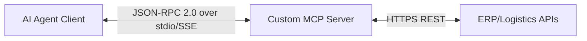

# MCP vs API: Hybrid Production Blueprint

This repository demonstrates a hybrid architecture where:

- **Traditional REST APIs** remain the deterministic system-of-record interface.
- **MCP** adds an agent-native translation/orchestration layer.

It includes:

1. A legacy-style REST API (`legacy_api.py`)
2. An MCP server exposing safe tools over that API (`supply_chain_mcp_server.py`)
3. An agent client orchestration example (`agent_client.py`)

## Why this matters

- REST/GraphQL are optimized for human developers and explicit integration contracts.
- MCP is optimized for LLM tool discovery, semantic intent mapping, and iterative agent loops.
- In production, MCP **does not replace** APIs; it wraps and governs access to them.

## Architecture



## Files

- `/home/runner/work/Mcp-vs-Api/Mcp-vs-Api/legacy_api.py`
- `/home/runner/work/Mcp-vs-Api/Mcp-vs-Api/supply_chain_mcp_server.py`
- `/home/runner/work/Mcp-vs-Api/Mcp-vs-Api/agent_client.py`
- `/home/runner/work/Mcp-vs-Api/Mcp-vs-Api/requirements.txt`

## Setup

```bash
cd /home/runner/work/Mcp-vs-Api/Mcp-vs-Api
python -m venv .venv
source .venv/bin/activate
pip install -r requirements.txt
```

## Run

Terminal 1:

```bash
cd /home/runner/work/Mcp-vs-Api/Mcp-vs-Api
uvicorn legacy_api:app --host 0.0.0.0 --port 8000
```

Terminal 2:

```bash
cd /home/runner/work/Mcp-vs-Api/Mcp-vs-Api
python agent_client.py
```

The client spawns the MCP server (`supply_chain_mcp_server.py`) over stdio and executes:
1. Inspect delayed shipment
2. Find alternate vendors
3. Execute reroute

## Notes for production hardening

- Enforce authN/authZ at API and MCP boundaries.
- Add idempotency persistence and replay protection.
- Add contract tests to detect downstream schema drift.
- Return summarized/paginated payloads to avoid context overflow.